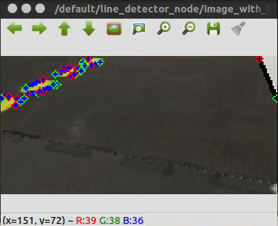

# sim-duckiebot-lanefollowing-demo

A simple demo of using the traditional Duckietown stack to do lane following in the simulator. Inside you will find the `docker-compose-lf.yml` file, which starts all of the necessary containers to launch the demo.

## Installation and Prerequisites

To get started, fork or clone this git repository and enter the project directory:

    git clone git@github.com:duckietown/sim-duckiebot-lanefollowing-demo.git

You will also need `docker-compose`. Follow instructions [here](https://docs.docker.com/compose/install/) to install. 

## Usage

To launch the lane following demo, run the following command:
    
    docker network create gym-duckietown-net && \
    docker-compose -f docker-compose-lf.yml pull && \
    docker-compose -f docker-compose-lf.yml up
    
The first two commands don't need to be run every time, so after pulling, you may just want to run the `up` command.

You will then start to see output from the Lane Following code, which can be found [here](https://github.com/duckietown/Software/tree/master18/catkin_ws/src/10-lane-control)

You can terminate the run at any time by pressing <kbd>CTRL</kbd>+<kbd>c</kbd>.

## Write your own agent

To write your own ROS agent, first fork this repository. Since we are going to be running a few containers, the best way to run is the `docker-compose` command found above.

Inside of the `docker-compose-lf.yml` file, you'll find that for purposes of this demo, we are using the `HOSTNAME=default`; the `HOSTNAME` can be thought of as the vehicle name. This is to help mitigate the discrepencies between the real robot and simulator when finding things like configuration files when using the old Duckietown stack.

### Making Edits

With `docker-compose`, your Dockerfiles will not rebuilt unless you tell them. There are two ways of going about this:

1. To rebuild everything, run `docker-compose -f docker-compose-lf.yml build [--no-cache]` before running `docker-compose -f docker-compose-lf.yml up`
2. (Preferred) Rebuild the container you've changed with `docker build -t "{your-containers-tag}" -f {corresponding-Dockerfile} .` and then `docker-compose -f docker-compose-lf.yml up`.

## Using your own ROS Nodes / Custom `catkin_ws`
Most likely, you'll want to work off of some of the standalone Duckietown code, but change a node or two. We will look at two examples:
(A) Adding to the pipeline and (B) "Cutting" the pipeline and inserting your node inside. Currently, you'll see that we have a `rosrun` command all the way at the bottom of the `docker-compose` file, which is where you'd put your `roslaunch` or `rosrun` command. We've provided an example node for you, that builds from `DockerfileCatkin`

To add your node to the pipeline, we give some simple example code. The files we're concerned with are:

`DockerfileCatkin`: To add your nodes to the `custom_ws`, follow the commented out instructions, paying close attention to which lines you should and should not be removing. We use something called [overlayed ROS workspaces](http://wiki.ros.org/catkin/Tutorials/workspace_overlaying), to make sure that your code (which most likely depends on the Duckietown ROS stack in some way) can find all of its dependencies.

`dt_dependent_node`: A simple, toy example of how to build a node that has a dependency with the current stack. You can use this as a model to build and add your own ROS nodes, making sure to edit the `CMakeLists.txt` (inside of your node, for dependencies + building things like msgs & services) and the Dockerfile to ensure your files and folders get copied into the `cudtom_ws/src` directory before you build with catkin_make.

`custom_line_detector`: A *copied* node from `10-lane-control` inside of the `Software` repo, we also provide this as an example of how to copy, edit, build, and launch a node. This serves as an example, and is commented out in `lf_slim.launch`. Remember, when copying a node, you either need to make sure that (A) that copied node isn't running with the same name elsewhere (just copy it out in the launch file) and that (B) you remap the topics properly.

`lf_slim.launch`: A launch file that launches the whole lane following stack, but at the bottom has the code to launch our simple test node. It launches nodes just the way you normally might in ROS, and because our workspaces are overlayed, will be able to find code or nodes in both your new workspace, as well as the old one.

To (B) Cut the pipeline, and insert your node in, you'll want to make use of [`<remap>` in the launch files](http://wiki.ros.org/Remapping%20Arguments). Simply take the topics you need from the last node from the existing pipeline, and remap them to what you're node takes in (usually, the node name will come first, to help ambiguities between nodes). Then, add your node(s), chaining them together with the remapping, and finally, remap your last nodes output to the topic you're interested in using - whether it be another node in the existing pipeline, or just the WheelCmd message that the rosagent.py is looking for to step in the environment.

## Debugging and Monitoring

With ROS, everything of interest is passed through the ROS Messaging system. There are two ways to monitor your progress:

### ROSBags

Inside of the `docker-compose-lf.yml` file, you will find a node called `rosmonitor`, which listens on a particular topic and records a bagfile to a mounted drive. This is so your container and host machine can read and write to the same disk location. Once you've recorded the bag file, you can play its contents back on your host machine with the following steps:
1. You can start a `roscore` in one terminal, and in another terminal, you will want to type in `rosbag play {PATH TO BAGFILE}`. Some nice additional command line options are `--loop` or `--rate {#}`.
2. Now, your host machine is in the same state as the Docker image when the bag was recorded. This means you can visualize the messages with things like `rqt` or `image_view`.

### Via Docker in Real Time

If you'd like to monitor the progress of your system realtime via the ROS messaging system, you can also connect to the same network from another Docker container, and monitor or record ROSBags in real time. To do this, you will need to run a command:

`docker run --entrypoint=qemu3-arm-static --network=gym-duckietown-net -it duckietown/rpi-duckiebot-base:master18 /bin/bash`

If you want to run ROS plugins such as `rqt*` or other graphical tools, you will need to [enable X11 forwarding](http://wiki.ros.org/docker/Tutorials/GUI#Using_X_server). To do so, you will need to first run `xhost +` on your host machine to allow incoming connections, then add the following flags to the above `docker run` command: `--env="DISPLAY" --env="QT_X11_NO_MITSHM=1" --volume="/tmp/.X11-unix:/tmp/.X11-unix:rw"`.

Which will give you a bash shell inside of a Duckietown-compatible Docker container (we can't use a normal ROS Kinetic container due to the fact that we need the Duckietown-specific messages to be built).

Inside of the shell, you will need to `export ROS_MASTER_URI=http://lanefollow:11311`, which will point to the ROS Master currently running in the `lanefollow` container.

### Troubleshooting

To check the available networks, run `docker network ls`. Occasionally Docker will create a second network, `sim-duckiebot-lanefollowing-demo_gym-duckietown-net` if the default one has already been created. If you want to override this behavior run `docker-compose up --force-recreate` to start everything from scratch.
